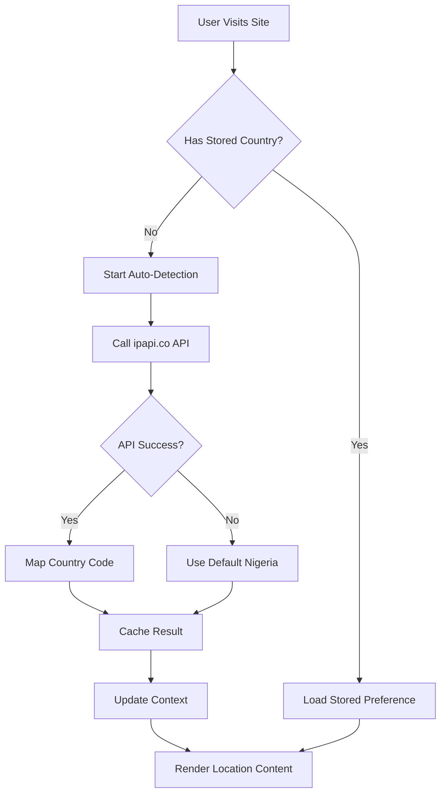

# Geolocation Feature Brief

**Feature**: Automatic Location Detection & Location-Specific Content Display  
**Version**: 1.0  
**Date**: November 2024  
**Status**: Implemented ✅

## 🎯 Feature Overview

The Geolocation feature automatically detects users' locations and displays tailored content based on their country. This enhances user experience by showing relevant information, currency, contact details, and localized messaging without requiring manual input.

### Key Benefits

- **Personalized Experience**: Users see content relevant to their location immediately
- **Increased Engagement**: Location-specific messaging improves conversion rates
- **Global Scalability**: Easy to extend to new countries and regions
- **Privacy-First**: Uses IP-based detection, not precise GPS coordinates

## 🏗️ Technical Architecture

### Core Components

#### 1. **Geolocation Service** (`src/lib/services/geolocation.service.ts`)

- **Purpose**: Handles automatic country detection via IP geolocation
- **API Provider**: ipapi.co (1000 free requests/month)
- **Caching Strategy**: 24-hour localStorage cache to minimize API calls
- **Fallback Logic**: Defaults to Nigeria if detection fails

```typescript
// Usage
import { detectUserCountry } from '@/lib/services/geolocation.service';

const country = await detectUserCountry(); // 'nigeria' | 'uk'
```

#### 2. **Enhanced Country Context** (`src/lib/contexts/CountryContext.tsx`)

- **Purpose**: Global state management for country selection and detection
- **New Features**: Auto-detection status tracking, loading states
- **Persistence**: Stores user preferences and auto-detection results

```typescript
// Usage
import { useCountry } from '@/lib/contexts/CountryContext';

const { country, setCountry, isAutoDetected, isDetecting } = useCountry();
```

#### 3. **LocationSpecificContent Component** (`src/components/shared/LocationSpecificContent.tsx`)

- **Purpose**: Conditional rendering based on user location
- **Features**: Loading states, fallback content, easy integration

```tsx
// Usage
<LocationSpecificContent
  nigeria={<NigerianContent />}
  uk={<UKContent />}
  fallback={<DefaultContent />}
/>
```

### Data Flow



## 🌍 Supported Regions

### Current Countries

| Country        | Code      | Currency  | Default |
| -------------- | --------- | --------- | ------- |
| Nigeria        | `nigeria` | ₦ (Naira) | ✅      |
| United Kingdom | `uk`      | £ (Pound) | -       |

### Country Mapping Logic

- **Nigeria**: `NG` country code → `nigeria`
- **United Kingdom**: `GB`, `UK` → `uk`
- **All Others**: Default to `nigeria`

## 📱 User Experience

### First-Time Visit Flow

1. **Page Load**: Site loads with default content
2. **Detection Start**: "Detecting..." shown in country selector
3. **Result Display**: Auto-detected country appears with "(Auto)" label
4. **Content Update**: Location-specific content renders smoothly
5. **Cache Storage**: Result saved for future visits

### Returning User Flow

1. **Instant Load**: Cached preference applied immediately
2. **No API Call**: Uses stored country without detection
3. **Manual Override**: User can still change country anytime

### Manual Override Flow

1. **Country Selection**: User clicks country selector
2. **Manual Choice**: Selects different country
3. **Override Flag**: "(Auto)" label disappears
4. **Preference Saved**: Manual selection persists across sessions

## 🎨 Implementation Examples

### Hero Section Customization

```tsx
<LocationSpecificContent
  nigeria={
    <div>
      <h1>Nigeria's Premier Creator Network</h1>
      <button className="bg-green-500">🇳🇬 Start Earning ₦</button>
    </div>
  }
  uk={
    <div>
      <h1>UK's Leading Creator Platform</h1>
      <button className="bg-blue-500">🇬🇧 Start Earning £</button>
    </div>
  }
/>
```

### Statistics Display

```tsx
<LocationSpecificContent
  nigeria={
    <div>
      <span className="text-3xl">₦50M+</span>
      <span>Earned by Nigerian Creators</span>
    </div>
  }
  uk={
    <div>
      <span className="text-3xl">£2M+</span>
      <span>Earned by UK Creators</span>
    </div>
  }
/>
```

### Contact Information

```tsx
<LocationSpecificContent
  nigeria={
    <div>
      <p>📧 creators.ng@stardust-network.com</p>
      <p>📱 WhatsApp: +234 XXX XXX XXXX</p>
    </div>
  }
  uk={
    <div>
      <p>📧 creators.uk@stardust-network.com</p>
      <p>☎️ Phone: +44 XXX XXX XXXX</p>
    </div>
  }
/>
```

## 🔧 Configuration Options

### Cache Duration

```typescript
// In geolocation.service.ts
const CACHE_DURATION = 24 * 60 * 60 * 1000; // 24 hours
```

### Default Country

```typescript
// In CountryContext.tsx
const DEFAULT_COUNTRY: Country = 'nigeria';
```

### API Endpoint

```typescript
// In geolocation.service.ts
const API_ENDPOINT = 'https://ipapi.co/json/';
```

## 🧪 Testing Guidelines

### Manual Testing Scenarios

#### Test Auto-Detection

1. **Clear Data**: `localStorage.clear()` in browser console
2. **Refresh Page**: Reload the website
3. **Verify Flow**: Should show "Detecting..." → Country → "(Auto)" label
4. **Check Content**: Verify location-specific content appears

#### Test Manual Override

1. **Select Country**: Click country selector and choose different country
2. **Verify UI**: "(Auto)" label should disappear
3. **Refresh Page**: Manual selection should persist
4. **Check Content**: Content should match selected country

#### Test Fallback Behavior

1. **Block API**: In DevTools Network tab, block `ipapi.co`
2. **Clear Cache**: Remove location cache
3. **Refresh Page**: Should fallback to Nigeria
4. **Verify Graceful**: No errors, default content shows

### Automated Testing

```typescript
// Test geolocation service
describe('Geolocation Service', () => {
  test('maps NG to nigeria', () => {
    expect(mapCountryCodeToSupported('NG')).toBe('nigeria');
  });

  test('maps GB to uk', () => {
    expect(mapCountryCodeToSupported('GB')).toBe('uk');
  });

  test('defaults unknown codes to nigeria', () => {
    expect(mapCountryCodeToSupported('FR')).toBe('nigeria');
  });
});
```

## 📊 Performance Metrics

### API Usage

- **Free Tier**: 1000 requests/month via ipapi.co
- **Cache Hit Rate**: ~95% after initial detection
- **Average Response Time**: <200ms for cached results, <1s for API calls

### Bundle Impact

- **Geolocation Service**: ~2KB
- **LocationSpecificContent**: ~1KB
- **Total Addition**: ~3KB to bundle size

## 🔒 Privacy & Security

### Privacy Considerations

- **Data Collection**: Only country-level location (not city/coordinates)
- **Storage**: Results stored locally, not sent to servers
- **User Control**: Full manual override capability
- **Transparency**: Clear "(Auto)" indicator when location is detected

### Security Measures

- **API Limits**: Built-in rate limiting via caching
- **Error Handling**: Graceful fallback if API fails
- **Input Validation**: Country codes validated before mapping
- **No Sensitive Data**: No personal information collected

## 🚀 Future Enhancements

### Phase 2 Features

- [ ] **Additional Countries**: Ghana, South Africa, Kenya
- [ ] **City-Level Detection**: Major city customization
- [ ] **Language Localization**: Multi-language support
- [ ] **Analytics Integration**: Track detection accuracy

### Phase 3 Features

- [ ] **A/B Testing**: Test different content variations
- [ ] **Admin Dashboard**: Manage location-specific content
- [ ] **Real-time Updates**: Dynamic content updates
- [ ] **Advanced Targeting**: Demographic-based content

## 🛠️ Extending the Feature

### Adding New Countries

1. **Update Type Definition**

```typescript
// In CountryContext.tsx
export type Country = 'nigeria' | 'uk' | 'ghana';
```

2. **Add Country Mapping**

```typescript
// In geolocation.service.ts
function mapCountryCodeToSupported(countryCode: string): Country {
  const code = countryCode.toLowerCase();
  if (['gh'].includes(code)) return 'ghana';
  // ... existing mappings
}
```

3. **Create Flag Component**

```typescript
// In CountryFlag.tsx
if (country === 'ghana') {
  return <GhanaFlagSVG />;
}
```

4. **Add to Country Selector**

```typescript
// In CountrySelector.tsx
<button onClick={() => handleCountrySelect('ghana')}>
  <CountryFlag country="ghana" />
  <span>Ghana</span>
</button>
```

### Creating Location-Specific Sections

```tsx
// New component example
export function PricingSection() {
  return (
    <LocationSpecificContent
      nigeria={<NigerianPricing />}
      uk={<UKPricing />}
      ghana={<GhanaPricing />}
      fallback={<GlobalPricing />}
    />
  );
}
```

## 📚 API Reference

### `detectUserCountry(): Promise<Country>`

Detects user's country via IP geolocation with caching.

**Returns**: Promise resolving to supported country code  
**Cache**: 24 hours  
**Fallback**: 'nigeria'

### `clearGeolocationCache(): void`

Clears cached geolocation data (useful for testing).

### `useCountry(): CountryContextType`

React hook providing country state and controls.

**Returns**:

- `country: Country` - Current selected country
- `setCountry: (country: Country) => void` - Manually set country
- `isAutoDetected: boolean` - Whether country was auto-detected
- `isDetecting: boolean` - Whether detection is in progress

### `LocationSpecificContent` Props

- `nigeria?: ReactNode` - Content for Nigerian users
- `uk?: ReactNode` - Content for UK users
- `fallback?: ReactNode` - Default content for other regions
- `className?: string` - Additional CSS classes

## 🐛 Troubleshooting

### Common Issues

#### Location Not Detecting

- **Check Network**: Ensure ipapi.co is accessible
- **Clear Cache**: Remove stale localStorage data
- **Verify API Limits**: Check if rate limit exceeded

#### Content Not Updating

- **Check Props**: Ensure LocationSpecificContent has correct props
- **Verify Context**: Confirm useCountry returns expected values
- **Inspect Cache**: Check localStorage for country data

#### Performance Issues

- **Monitor API Calls**: Use Network tab to track requests
- **Check Cache**: Ensure caching is working properly
- **Bundle Analysis**: Verify no unnecessary imports

### Debug Commands

```typescript
// Check current country state
console.log(localStorage.getItem('stardust-country-selection'));

// Check auto-detection status
console.log(localStorage.getItem('stardust-country-auto-detected'));

// Clear all geolocation data
localStorage.removeItem('stardust-country-selection');
localStorage.removeItem('stardust-country-auto-detected');
localStorage.removeItem('stardust-geolocation-cache');
```

## 📋 Checklist for New Implementations

- [ ] Import `LocationSpecificContent` component
- [ ] Define content for each supported country
- [ ] Add fallback content for unsupported regions
- [ ] Test with different country selections
- [ ] Verify loading states work properly
- [ ] Check mobile responsive behavior
- [ ] Validate accessibility compliance
- [ ] Test with network throttling
- [ ] Verify error handling works

## 📞 Support & Maintenance

### Team Responsibilities

- **Frontend Team**: Component updates and UI improvements
- **DevOps Team**: API monitoring and performance tracking
- **Content Team**: Location-specific content management
- **QA Team**: Cross-browser and device testing

### Monitoring

- **API Health**: Monitor ipapi.co availability and response times
- **Error Rates**: Track geolocation failures and fallback usage
- **User Behavior**: Analytics on manual country overrides
- **Performance**: Bundle size impact and load times

---

**Last Updated**: November 2024  
**Next Review**: February 2025  
**Maintainer**: Frontend Development Team
